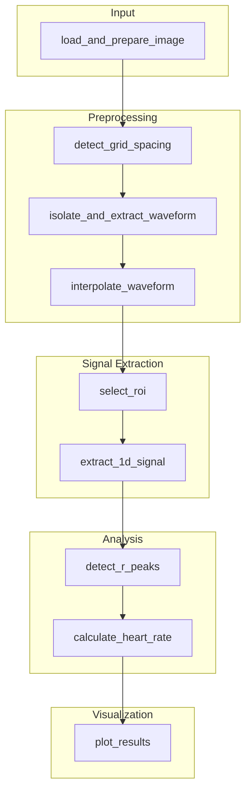

# 🫀 ECG Image Analyzer

A modular Python toolkit for analyzing ECG waveforms directly from scanned images.  
It supports preprocessing, deskewing, waveform isolation, signal extraction, and R-peak-based heart rate calculation.

---

# ⚠️ Under-development. Not at all accurate and 'possibly' never will be

## 📦 Features

- ✅ Load & preprocess scanned ECG images
- 🔄 Deskew to correct misalignment
- 🔍 Robust grid spacing detection (in pixels per mm)
- ✂️ Waveform isolation from the grid
- 📈 1D signal extraction from selected lead (ROI)
- 📊 R-peak detection with adaptive thresholding
- ❤️ Heart rate estimation (bpm) based on RR intervals
- 📸 Visualization of all major processing steps

---

## 🛠 Installation

```bash
git clone https://github.com/schr-0dinger/ECG-Interpretation.git
cd ECG-Interpretation
pip install -r requirements.txt 
```

## 🚀 Usage

```bash
python main.py
```
## 📂 Project Structure

```bash
ecg-analyzer/
├── main.py                    # Object-oriented ECG pipeline
├── ecg_image_loader.py        # Loads and deskews ECG images
├── grid_detection.py          # Detects vertical and horizontal spacing (grid size)
├── isolate_waveform.py        # Removes background grid and isolates the waveform
├── waveform_extraction.py     # Extracts signal in real-world units (time-voltage)
├── deskew.py                  # Skew detection via image moments
└── images/
    ├── sample.png             # Example ECG input image
    └── sample*.png
```




## 📊 Output Example
- Original + Interpolated waveform
- ROI view (lead selection)
- Smoothed 1D signal with R-wave peaks
- Calculated heart rate series
- Mode-based average heart rate

📝 TODO
 - [ ] Run grid detection on cropped ROI (tmp)
 - [ ] Add CSV export for extracted signal and HR
 - [ ] Multi-lead support (Lead I, II, V1–V6)
 - [ ] Auto-lead segmentation from full ECG strips
 - [ ] Noise filtering using signal-processing techniques (Butterworth, Savitzky–Golay)
 - [ ] GUI for visual selection and processing
 - [ ] CLI tool with argument options
 - [ ] Add unit tests and CI/CD workflow
 - [ ] Optional ML-based R-peak detector fallback

## 📚 Requirements
- Python 3.8+
- OpenCV
- NumPy
- SciPy
- Matplotlib

#### Install with:
```bash
pip install -r requirements.txt
```

## 🧠 Credits
Developed with ❤️ for research and signal processing experimentation.

## ⚠️ Disclaimer
This tool is intended for educational and experimental use only.
It is not certified for clinical or diagnostic purposes.


